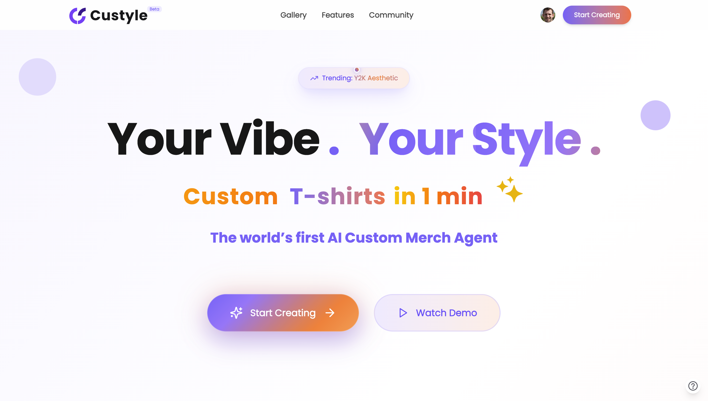
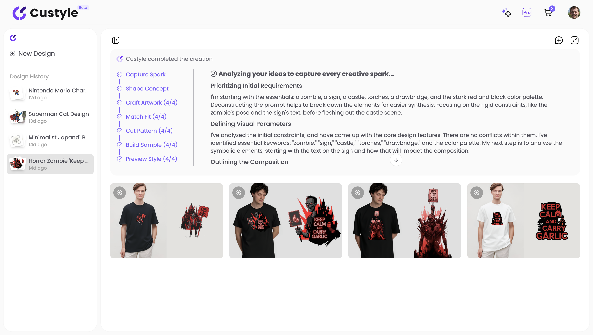
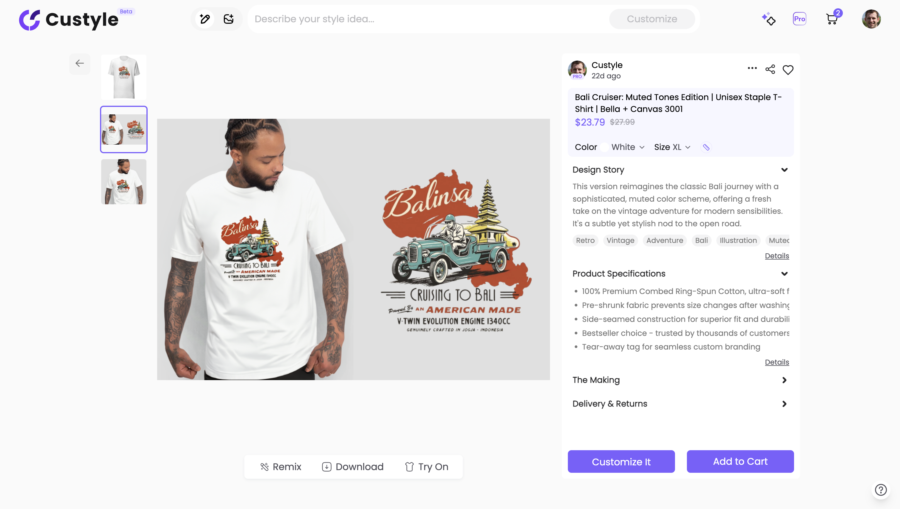

# CUSTYLE.AI — The AI Merch Agent for Self-Expression

[](https://custyle.ai)
[](https://discord.gg/7B52gKXx)
[](https://x.com/custyleai)
[](https://www.instagram.com/custyle.ai)

> Most commerce begins with products. Custyle begins with people.

You have a vibe — a memory, a meme, an inside joke, an aesthetic that's just *you*. You want it on a hoodie, a pair of sneakers, a piece of jewelry, a canvas on your wall. But you can't design. You don't have a factory. You just have the feeling.

**Custyle is the AI Merch Agent that turns that feeling into something real.** Describe what you want, and a crew of 9 specialized AI agents handles everything — creative direction, artwork, product matching, manufacturing, and delivery. No design skills. No minimum orders. No generic-looking merch.

**[Turn any vibe into something real →](https://custyle.ai)**



---

## The Problem

Everyone has the urge to express. 99% are blocked by execution cost.

You want a T-shirt celebrating your gaming achievement. A mug with your cat in a style that actually looks good. A hoodie that captures an inside joke only your friend group gets. A gift that says "I really know you."

Your options today:

| Option | The gap |
|--------|---------|
| **Design tools** (Canva, Photoshop) | You need design skills you don't have |
| **POD platforms** (Redbubble, TeeSpring) | You upload a finished design — but you don't have one |
| **Generic merch** | Everyone wears the same thing |

**Creativity is universal. Execution is the bottleneck.** Ideas are light. Making them real is heavy.

Custyle closes this gap. You bring the vibe. We make it real.

---

## How It Works

```
Your idea (text, photo, vibe, even something vague)
    ↓
9 AI agents collaborate in parallel
    ↓
Print-ready design + right product + realistic try-on preview
    ↓
One-click order → Built and shipped to your door
```

**1. Express.** Type what you want. Drop a photo. Describe a vibe. Even a half-formed idea works — the AI sharpens it with you.

**2. The Crew takes over.** 9 specialized AI agents collaborate — reading your taste, shaping the concept, creating the artwork, selecting the right product and production process, rendering studio-grade try-on previews.

**3. Approve and order.** See your design on the actual product. Try it on a virtual model. Love it? One click. Built and shipped to your door.

From feeling to physical product. Minutes, not weeks.

)




---

## Meet the Crew — 9 AI Agents, One Creative Team

Not one AI. A whole crew built to get your merch right.

| Agent | Role | What they do |
|-------|------|-------------|
| **Vibbi** | Design Lead | Orchestrates the full creative pipeline. Turns messy ideas into a clear creative path. |
| **Pia** | Preference Reader | Picks up your taste, references, and unspoken leanings — fast. |
| **Nova** | Concept Shaper | Turns loose prompts into stronger creative directions with more point of view. |
| **Ink** | Artwork Maker | Builds the visual language and details that make the design feel like a real piece. |
| **Bolt** | Production Brain | Figures out the best way to build it — right process, right material, right quality. |
| **Axis** | Product Architect | Finds the right product form for your idea. |
| **Grid** | Layout Specialist | Gets composition, spacing, and merch balance right. |
| **Moxy** | Try-On Director | Shows how your design looks on a real person. |
| **Lumi** | Scene Stylist | Builds the mood, context, and atmosphere around what you made. |

Every design goes through 9 layers of intelligence. Not just generated — shaped, matched, placed, and built for real-world quality.

---

## What You Can Create

### The Product Engine — Everything Can Be Customized

Custyle isn't limited to a fixed product catalog. We've built a **Product Engine** — an intelligent layer that connects to global supply chains, sourcing manufacturers who can custom-produce what your idea demands. For every design, the engine finds the right supplier, the right technique, and the right material.

The vision: **everything can be customized.** A T-shirt today. A pair of custom sneakers tomorrow. A piece of projection jewelry next week. The Product Engine is the bridge between your imagination and the world's manufacturing capabilities.

### Hundreds of Product Types Across 12+ Categories

<details>
<summary><b>Apparel</b> — Men's, Women's, Kids & Youth</summary>

T-shirts · All-over shirts · Polo shirts · Tank tops · Crop tops · Long sleeve shirts · 3/4 sleeve shirts · Embroidered shirts · Hawaiian shirts · Hoodies · Sweatshirts · Jackets & vests · Knitwear · Dresses · Sweatpants & joggers · Leggings · Shorts · Pants · Skirts · Underwear · Swimwear · Sleepwear · Sports bras · Photo pajamas · Baby bodysuits
</details>

<details>
<summary><b>Hats</b></summary>

Beanies · Baseball caps · Snapbacks · Trucker hats · 5-panel hats · Mesh hats · Bucket hats · Visors
</details>

<details>
<summary><b>Bags & Wallets</b></summary>

Tote bags · Backpacks · Duffle bags · Drawstring bags · Fanny packs · Handbags · School bags · Canvas bags · Men's wallets · Women's wallets
</details>

<details>
<summary><b>Footwear</b></summary>

Shoes · Flip flops · Slippers · Socks
</details>

<details>
<summary><b>Accessories</b></summary>

Keychains (acrylic, leather, crystal, metal, wood, building block) · Patches · Pins · Hair accessories · Face masks · Lighters · Magic cubes
</details>

<details>
<summary><b>Tech Accessories</b></summary>

Phone cases · AirPods & earphone cases · Laptop cases · Mouse pads
</details>

<details>
<summary><b>Home & Living</b></summary>

Wall art · Posters · Framed posters · Canvas prints · Metal prints · Blankets · Pillows & pillow cases · Candles · Night lights · Photo frames · Desk decor · Hanging ornaments · Floor mats · Flags & signs · Magnets · Puzzles · Building bricks · Plant pots · Lantern lights · Balloons · Holiday decor
</details>

<details>
<summary><b>Drinkware</b></summary>

Mugs · Tumblers · Water bottles · Coasters · Glassware
</details>

<details>
<summary><b>Stationery</b></summary>

Notebooks · Stickers · Postcards · Greeting cards · Calendars
</details>

<details>
<summary><b>Jewelry</b></summary>

Photo necklaces · Locket necklaces · Photo watches · Wooden watches · Photo charms · Projection bracelets
</details>

<details>
<summary><b>Pet Products</b></summary>

Custom pet accessories and gear
</details>

<details>
<summary><b>Toys & Games</b></summary>

Building blocks · Puzzles · Custom figures · Music boxes
</details>

> This is a partial list. The Product Engine continuously connects new suppliers and manufacturing capabilities. The goal is not "the most SKUs" — it's that **every expression finds its right physical form**, whatever that form may be.

---

### 8 Expression Scenes

The Product Engine is powerful, but Custyle doesn't start from product categories. It starts from *why you want to create*:

| Scene | What it sounds like |
|-------|-------------------|
| **Identity** | *"A shirt that feels like me — dark academia meets cyberpunk"* |
| **Relationship** | *"Something for my partner with our inside joke about penguins"* |
| **Memory** | *"A hoodie commemorating our graduation trip to Kyoto"* |
| **Community** | *"Merch for our Discord server with our custom mascot"* |
| **Mood** | *"I just beat Elden Ring — I need this moment on a shirt"* |
| **Gift** | *"A birthday mug for my cat-obsessed friend"* |
| **Event** | *"Team shirts for our hackathon this weekend"* |
| **Signal** | *"A tote bag that says 'I have taste' without saying it"* |

You describe the expression. The Product Engine figures out the best product to carry it.



---

## Not Printed On. Built for You.

Custyle is not a print-on-demand platform with an AI skin. It's an AI Agent backed by a Product Engine that connects to global supply chains and understands how to build things right.

|  | Design tools | POD platforms | **Custyle** |
|--|-------------|--------------|---------|
| **Starting point** | Blank canvas | Upload your design | Describe your idea |
| **Design skills** | Expert | Intermediate | None |
| **Product intelligence** | None | None | Product Engine selects best product, process, material, and supplier |
| **Preview** | N/A | Basic mockup | AI try-on + lifestyle scenes |
| **Manufacturing** | N/A | Print what you upload | Built for your specific design |
| **Result** | Depends on your skill | What you uploaded | What you imagined — made real |

The difference: your design drives the production process. The process matches the material. The material determines the quality. The Product Engine finds the best manufacturer on the planet to build it. That's what "built for you" means — not a sticker on a blank.

---

## The Thesis: Why This Matters Now

### Demand side — what's changing about how people consume

Three things about humans don't change:

1. **People need to be seen.** Clothing's deepest function isn't warmth — it's identity signaling. *"This is who I am."*
2. **People need to externalize inner states.** Emotions, memories, belonging — we turn the intangible tangible. Journals, tattoos, T-shirts — different carriers of the same human impulse.
3. **People need low-friction creation.** Not just consumption — participation. This is why Instagram beat cameras, Canva beat Photoshop, TikTok beat professional editing software. Products that lower the creation threshold release suppressed demand, not manufactured demand.

What IS changing: **when creation cost approaches zero, self-expression shifts from "I buy therefore I am" to "I create therefore I am."** The next generation doesn't want to pick from a brand menu — they want to make it themselves.

### Supply side — what's changing about how things are made

The minimum economic unit of manufacturing is shrinking from ten thousand pieces to one. Three forces:

- **Digital printing** (DTG/DTF/sublimation) makes "changing a design" near-free — no molds, no screens, just different data
- **AI-driven production optimization** shrinks process switching from hours to minutes
- **Intelligent scheduling** lets 100 different single-piece orders share one production run

When switching cost approaches zero, the per-unit cost of one piece approaches the per-unit cost of ten thousand.

### What Custyle is betting on

> When creation cost hits zero and single-piece manufacturing becomes viable, the missing piece is: **who translates a person's expression impulse into a manufacturing instruction?**

That's Custyle. Not a factory. Not a design tool. A super design-production engine — the translation layer between what you feel and what the world's factories can build. Every imagination deserves a chance to become a physical product.

```
Demand Evolution                         Supply Evolution

Mass standardized consumption            Mass centralized manufacturing
         ↓                                        ↓
Segmented brand consumption              Small-batch flexible manufacturing
         ↓                                        ↓
Personalized selection                   Print-on-demand
         ↓                                        ↓
★ Individual expression ←───── Custyle ─────→ ★ Single-piece intelligent custom
         ↓                                        ↓
AI agent consumption                     Distributed micro-factory networks
```

Custyle sits at the intersection of individual expression consumption and single-piece intelligent custom — the transition happening right now.

---

## Technology

Custyle is built as a **multi-agent system**, not a monolithic AI wrapper.

| Layer | Stack |
|-------|-------|
| **AI Orchestration** | LangGraph — stateful multi-agent workflows with 9 specialized agents |
| **Language Models** | Google Gemini (primary) + Anthropic Claude (automatic fallback) |
| **Image Generation** | Fal.ai (Imagen 4) + Seedream |
| **Semantic Memory** | Gemini Embeddings — learns your taste over time |
| **Agent Protocol** | MCP SDK — 25 callable tools for agentic commerce |
| **Frontend** | Nuxt 3 + Vue 3 + TypeScript + Tailwind CSS |
| **Backend** | NestJS + Prisma + PostgreSQL + Valkey |
| **Product Engine** | Global supply chain routing — matches designs to optimal manufacturers |
| **Fulfillment** | Multi-supplier network (POD + C2M), continuously expanding |
| **Payments** | Stripe |

### Reliability

- Every primary AI node has an automatic fallback path
- Workflow state is persisted — crash-resilient, resumable
- Real-time control — users can pause or redirect creation mid-flow
- Quality scoring across 6 dimensions: aesthetic, composition, relevance, engagement, novelty, safety

---

## Roadmap

| Phase | Status | What |
|-------|--------|------|
| **Phase 1: AI Merch Agent** | **Live** | Product Engine with hundreds of categories, 9 AI agents, global multi-supplier fulfillment, credit system, virtual try-on |
| **Phase 1.5: Manufacturing Expansion** | Next | Deeper supply chain integration — more techniques, more materials, more product forms. Moving toward "everything can be customized." |
| **Phase 2: Expression Scenarios** | Planned | Become the default for expression moments: Pet Merch, Meme Culture, Creator Drops, Gifting, Events |
| **Phase 3: Agent Protocol** | Planned | Upgrade from website to callable node — any AI agent worldwide can call Custyle for "expression → physical product" |

**The endgame:** when any AI assistant needs to turn imagination into a physical product — any product — it calls Custyle.

---

## FAQ

### Who is Custyle for?

Anyone who has ideas but not design skills. Gamers celebrating achievements. Couples capturing memories. Friend groups immortalizing inside jokes. Creators launching merch. Small teams making event shirts. Someone who wants a custom necklace with a hidden photo. If you've ever thought *"I wish this existed as a real thing"* — Custyle is for you.

### Do I need design skills?

No. Describe what you want in words, drop a photo, or just describe a mood. The AI crew handles creative direction, artwork, product selection, and production. Your taste is the input — not your Photoshop skill.

### How is this different from Redbubble or TeeSpring?

Those platforms require you to upload a finished design. Custyle starts from your idea — even a vague one — and creates the design, selects the right product, and handles production. It's the difference between a file uploader and a creative partner.

### How is this different from Midjourney or other AI image generators?

Image generators give you a PNG. Custyle gives you a physical product. The design is created specifically for merch — right resolution, right color space, right placement on the product, right production technique. A screen graphic ≠ a merch-ready design.

### How long does creation take?

Design generation takes minutes. Production and shipping depend on your location — typically 3-7 business days via Printful's global fulfillment network.

### What products can I make?

Hundreds of product types across apparel, hats, bags, footwear, accessories, home decor, drinkware, stationery, jewelry, tech accessories, pet products, and more. The Product Engine continuously connects to new suppliers — the catalog is always growing. The goal is that every expression finds its right physical form.

### What does it cost?

T-shirts start around $20. Mugs around $12. Pricing varies by product type and manufacturing technique. Pro membership at $19.9/month unlocks more credits and priority access to new features.

### Can I sell what I create?

Yes. Create, publish, and sell. Every user can be a creator, buyer, and seller in the same experience.

### Is AI replacing human creativity?

No. Your taste is the input, not the output. AI handles the execution gap — the space between "I have an idea" and "I'm holding the product." Your aesthetic judgment drives everything. AI makes the cost of execution approach zero. It doesn't replace what only you can bring: your point of view.

---

## Get Started

**[Create your first merch →](https://custyle.ai)** Takes 2 minutes. No signup required to explore.

**[Join the community →](https://discord.gg/7B52gKXx)** Share what you create, get inspiration, give feedback.

**[Follow the journey →](https://x.com/custyleai)** Twitter/X · [Instagram](https://www.instagram.com/custyle.ai)

---

If you believe self-expression should be accessible to everyone, give this repo a **star** — it helps more people discover Custyle.

<p align="center">
  <b>You just express. We build for you.</b><br>
  <sub>你只管表达，我们为你而造。</sub><br><br>
  <a href="https://custyle.ai">custyle.ai</a>
</p>
